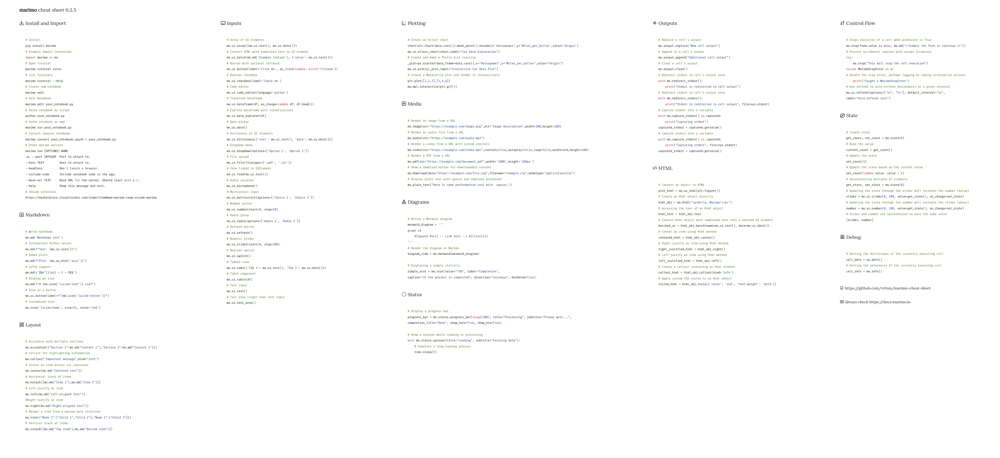

# marimo cheat sheet

A marimo app that includes a typed up summary of marimo docs 0.2.5


## Source:

* [docs.marimo.io](https://docs.marimo.io)
* **Always make sure to initially review https://docs.marimo.io** 

## App author/layout/design
* [@vrtnis](https://github.com/vrtnis/)
* Inspired by the streamlit cheat sheet

## Versioning
* Based on marimo 0.2.5 


## Requirements
marimo (pip install marimo)


## Screenshot


---


## Install and Import

```   
# Install
pip install marimo
# Example Import Convention
import marimo as mo
# Open Tutorial
marimo tutorial intro
# List Tutorials
marimo tutorial --help
# Create new notebook
marimo edit
# Edit Notebook
marimo edit your_notebook.py
# Serve notebook as script
python your_notebook.py
# Serve notebook as app
marimo run your_notebook.py
# Convert Jupyter notebook
marimo convert your_notebook.ipynb > your_notebook.py
# Other marimo options
marimo run [OPTIONS] NAME
-p, --port INTEGER  Port to attach to.
--host TEXT         Host to attach to.
--headless          Don't launch a browser.
--include-code      Include notebook code in the app.
--base-url TEXT     Base URL for the server. Should start with a /.
--help              Show this message and exit.
# VSCode extension
https://marketplace.visualstudio.com/items?itemName=marimo-team.vscode-marimo

```

## Markdown
            
```python
# Write markdown
mo.md('Markdown text')
# Interpolate Python values
mo.md(f"Text: {mo.ui.text()}")
# Embed plots
mo.md(f"Plot: {mo.as_html('axis')}")
# LaTeX support
mo.md(r'$$e^{i\pi} + 1 = 0$$')
# Display an icon
mo.md(f"# {mo.icon('lucide:leaf')} Leaf")
# Icon in a button
mo.ui.button(label=f"{mo.icon('lucide:rocket')}")
# Customized icon
mo.icon('lucide:home', size=24, color='red')

```

## Layout
               
```python
# Accordion with multiple sections
mo.accordion({"Section 1":mo.md("Content 1"),"Section 2":mo.md("Content 2")})
# Callout for highlighting information
mo.callout("Important message",kind="info")
# Center an item within its container
mo.center(mo.md("Centered text"))
# Horizontal stack of items
mo.hstack([mo.md("Item 1"),mo.md("Item 2")])
# Left-justify an item
mo.left(mo.md("Left-aligned text"))
#Right-justify an item
mo.right(mo.md("Right-aligned text"))
# Render a tree from a nested data structure
mo.tree({"Node 1":["Child 1","Child 2"],"Node 2":["Child 3"]})
# Vertical stack of items
mo.vstack([mo.md("Top item"),mo.md("Bottom item")])
```

        
## Inputs

```python
# Array of UI elements
mo.ui.array([mo.ui.text(), mo.ui.date()])
# Convert HTML with templated text to UI element
mo.ui.batch(mo.md('Example {value}'), {'value': mo.ui.text()})
# Button with optional callback
mo.ui.button(label='Click me', on_click=lambda: print('Clicked'))
# Boolean checkbox
mo.ui.checkbox(label='Check me')
# Code editor
mo.ui.code_editor(language='python')
# Transform DataFrame
mo.ui.dataframe(df, on_change=lambda df: df.head())
# Explore DataFrame with visualizations
mo.ui.data_explorer(df)
# Date picker
mo.ui.date()
# Dictionary of UI elements
mo.ui.dictionary({'text': mo.ui.text(), 'date': mo.ui.date()})
# Dropdown menu
mo.ui.dropdown(options=['Option 1', 'Option 2'])
# File upload
mo.ui.file(filetypes=['.pdf', '.txt'])
# Form linked to UIElement
mo.ui.form(mo.ui.text())
# Audio recorder
mo.ui.microphone()
# Multiselect input
mo.ui.multiselect(options=['Choice 1', 'Choice 2'])
# Number picker
mo.ui.number(start=0, stop=10)
# Radio group
mo.ui.radio(options=['Radio 1', 'Radio 2'])
# Refresh button
mo.ui.refresh()
# Numeric slider
mo.ui.slider(start=0, stop=100)
# Boolean switch
mo.ui.switch()
# Tabbed view
mo.ui.tabs({'Tab 1': mo.ui.text(), 'Tab 2': mo.ui.date()})
# Table component
mo.ui.table(df)
# Text input
mo.ui.text()
# Text area larger than text input
mo.ui.text_area()

```
   
        
## Plotting        
            
```python
# Create an Altair chart
chart=alt.Chart(data.cars()).mark_point().encode(x='Horsepower',y='Miles_per_Gallon',color='Origin')
mo.ui.altair_chart(chart,label="Car Data Exploration")
# Create and make a Plotly plot reactive
_plot=px.scatter(data_frame=data.cars(),x="Horsepower",y="Miles_per_Gallon",color="Origin")
mo.ui.plotly(_plot,label="Interactive Car Data Plot")
# Create a Matplotlib plot and render it interactively
plt.plot([1,2,3],[4,5,6])
mo.mpl.interactive(plt.gcf())

```

## Media
            
            
```python
# Render an image from a URL
mo.image(src="https://example.com/image.png",alt="Image description",width=100,height=100)
# Render an audio file from a URL
mo.audio(src="https://example.com/audio.mp3")
# Render a video from a URL with custom controls
mo.video(src="https://example.com/video.mp4",controls=True,autoplay=False,loop=False,width=640,height=480)
# Render a PDF from a URL
mo.pdf(src="https://example.com/document.pdf",width='100%',height='500px')
# Show a download button for downloadable content
mo.download(data="https://example.com/file.zip",filename="example.zip",mimetype="application/zip")
# Display plain text with spaces and newlines preserved
mo.plain_text("Here is some preformatted text with  spaces.")

```
            
            
## Diagrams

            
```python
# Define a Mermaid diagram
mermaid_diagram = '''
graph LR
    A[Square Rect] -- Link text --> B((Circle))
'''
# Render the diagram in Marimo
diagram_view = mo.mermaid(mermaid_diagram)

# Displaying a simple statistic
simple_stat = mo.stat(value="75%", label="Completion",  
caption="of the project is completed", direction="increase", bordered=True)
```

## Status
            
```python
# Display a progress bar
progress_bar = mo.status.progress_bar(range(100), title="Processing", subtitle="Please wait...",  
completion_title="Done", show_rate=True, show_eta=True)

# Show a spinner while loading or processing
with mo.status.spinner(title="Loading", subtitle="Fetching data"):
    # Simulate a long-running process
    time.sleep(5)

```

            
## Outputs
                 
```python

# Replace a cell's output
mo.output.replace("New cell output")
# Append to a cell's output
mo.output.append("Additional cell output")
# Clear a cell's output
mo.output.clear()
# Redirect stdout to cell's output area
with mo.redirect_stdout():
    print("Stdout is redirected to cell output")
# Redirect stderr to cell's output area
with mo.redirect_stderr():
    print("Stderr is redirected to cell output", file=sys.stderr)
# Capture stdout into a variable
with mo.capture_stdout() as captured:
    print("Capturing stdout")
captured_stdout = captured.getvalue()
# Capture stderr into a variable
with mo.capture_stderr() as captured:
    print("Capturing stderr", file=sys.stderr)
captured_stderr = captured.getvalue()

```
            
## HTML

       
```python
# Convert an object to HTML
plot_html = mo.as_html(plt.figure())
# Create an Html object directly
html_obj = mo.Html("<p>Hello, Marimo!</p>")
# Accessing the text of an Html object
html_text = html_obj.text
# Convert Html object with templated text into a batched UI element
batched_ui = html_obj.batch(name=mo.ui.text(), date=mo.ui.date())
# Center an item using Html method
centered_html = html_obj.center()
# Right-justify an item using Html method
right_justified_html = html_obj.right()
# Left-justify an item using Html method
left_justified_html = html_obj.left()
# Create a callout containing an Html element
callout_html = html_obj.callout(kind='info')
# Apply custom CSS styles to an Html object
styled_html = html_obj.style({'color': 'red', 'font-weight': 'bold'})

```

            
## Control Flow
             
            
```python
# Stops execution of a cell when predicate is True
mo.stop(form.value is None, mo.md("**Submit the form to continue.**"))
# Prevent accidental capture with except Exception 
try:
    mo.stop("This will stop the cell execution")
except MarimoStopError as e:
# Handle the stop error, perhaps logging or taking alternative actions
    print("Caught a MarimoStopError")
# Use refresh to auto-refresh descendants at a given interval
mo.ui.refresh(options=["1s", "5s"], default_interval="1s", 
label="Auto-refresh rate")
```
            
## State

```python
# Create state
get_count, set_count = mo.state(0)
# Read the value
current_count = get_count()
# Update the state
set_count(1)
# Update the state based on the current value
set_count(lambda value: value + 1)
# Synchronizing multiple UI elements
get_state, set_state = mo.state(0)
# Updating the state through the slider will recreate the number (below)
slider = mo.ui.slider(0, 100, value=get_state(), on_change=set_state)
# Updating the state through the number will recreate the slider (above)
number = mo.ui.number(0, 100, value=get_state(), on_change=set_state)
# Slider and number are synchronized to have the same value
[slider, number]

```

## Debug
            
            
```python
# Getting the definitions of the currently executing cell
cell_defs = mo.defs()
# Getting the references of the currently executing cell
cell_refs = mo.refs()

```


### Marimo Docs
<small>[Docs](https://docs.marimo.io)</small><br>


---
